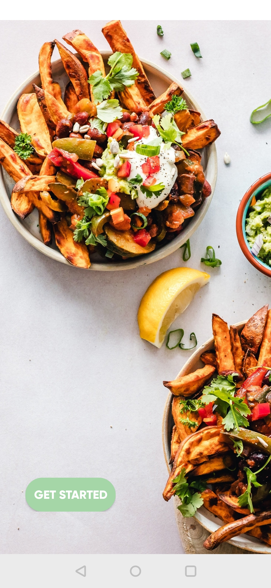
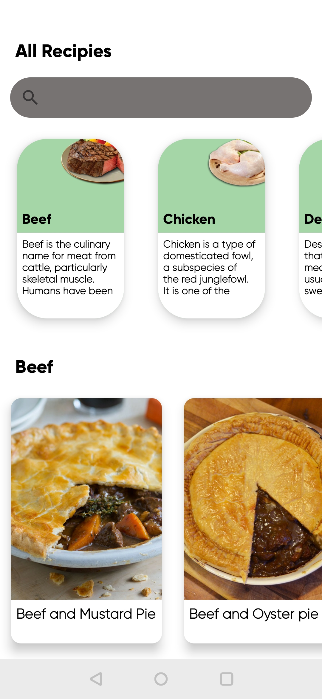
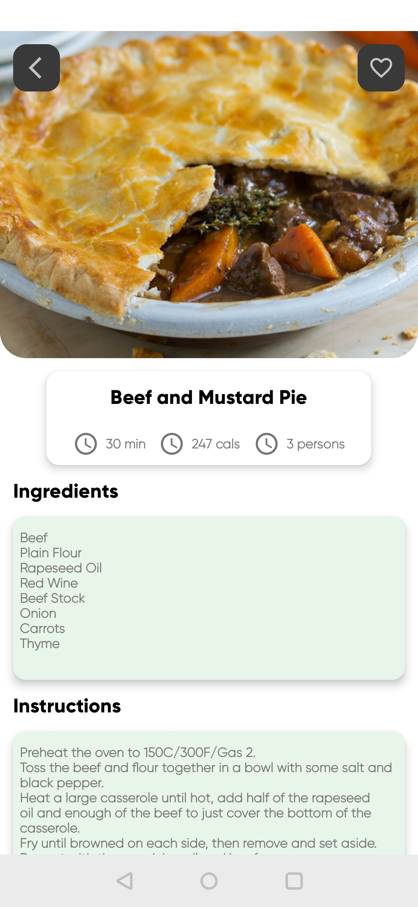
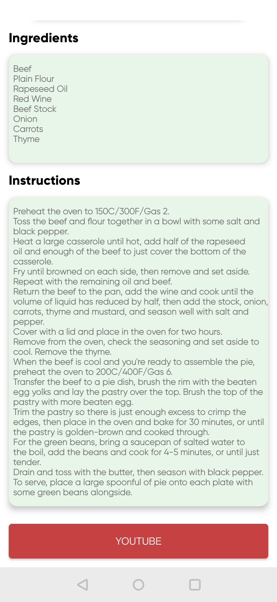

# Android--Native-Recipe- App-with-Database
1. Native Android App developed in Kotlin.
2. MVVM Architecture
3. Room Database for storing data.
4. Dagger Hilt for depenedancy injection.
5. Retrofit2 and RecyclerView.

Note: Same app is develoed using React Native. Refer link below:
https://github.com/KetanBhangale/React-Native-Recipe-App-with-Database.git

Screenshots:

     &nbsp;&nbsp;&nbsp;  
    

     

     &nbsp;&nbsp;&nbsp;  
    

     

